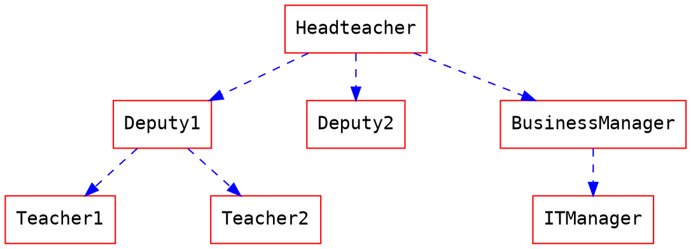
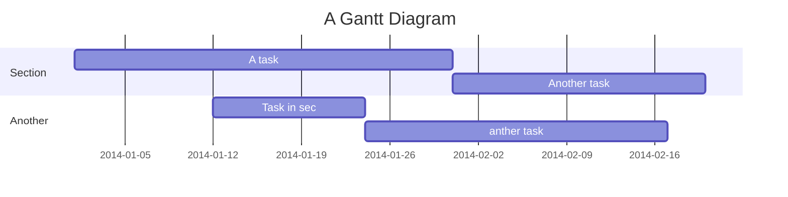

如何撰寫數學式及圖表
===



**[:arrow_right: 看此筆記的原始碼 :arrow_left:](/MathJax-and-UML-tw?both)**

您可以在 HackMD 上撰寫出很多種圖表與數學表達式，請參考以下的範例：

## MathJax

您可以使用 **MathJax** 語法 來產生 *LaTeX* 數學表達式，如同 [math.stackexchange.com](http://math.stackexchange.com/)，但是開始的 `$` 後面以及結尾的 `$` 前面不能有空白：

The *Gamma function* satisfying $\Gamma(n) = (n-1)!\quad\forall n\in\mathbb N$ is via the Euler integral

使用區塊層級的數學式時，請在您的數學式之前與之後給予 `$$` 以及換行：

$$
x = {-b \pm \sqrt{b^2-4ac} \over 2a}.
$$

$$
\Gamma(z) = \int_0^\infty t^{z-1}e^{-t}dt\,.
$$

[更多關於 **LaTeX** 數學表達式 <i class="fa fa-external-link"></i>](http://meta.math.stackexchange.com/questions/5020/mathjax-basic-tutorial-and-quick-reference)

UML 圖表
---
### 循序圖

```sequence
艾莉絲->包柏: 哈摟，你好嗎？
Note right of 包柏: 包柏思考中
包柏-->艾莉絲: 我很好，謝謝！
Note left of 艾莉絲: 艾莉絲回應
艾莉絲->包柏: 最近過得怎樣？
```
[更多關於 **循序圖** 語法 <i class="fa fa-external-link"></i>](http://bramp.github.io/js-sequence-diagrams/)
&nbsp;
&nbsp;

---

### 流程圖

您可以像是以下使用流程圖：
```flow
st=>start: 開始
e=>end: 結束
op=>operation: 我的操作
op2=>operation: 啦啦啦
cond=>condition: 是或否？

st->op->op2->cond
cond(yes)->e
cond(no)->op2
```


[更多關於 **流程圖** 語法 <i class="fa fa-external-link"></i>](http://adrai.github.io/flowchart.js/)

&nbsp;
&nbsp;

---

### Graphviz

[更多關於 **graphviz** 語法 <i class="fa fa-external-link"></i>](http://www.tonyballantyne.com/graphs.html)
&nbsp;
&nbsp;

---


### Mermaid

[更多關於 **mermaid** 語法 <i class="fa fa-external-link"></i>](http://mermaid-js.github.io/mermaid)
&nbsp;
&nbsp;

---


### Abc
```abc
X:1
T:Speed the Plough
M:4/4
C:Trad.
K:G
|:GABc dedB|dedB dedB|c2ec B2dB|c2A2 A2BA|
GABc dedB|dedB dedB|c2ec B2dB|A2F2 G4:|
|:g2gf gdBd|g2f2 e2d2|c2ec B2dB|c2A2 A2df|
g2gf g2Bd|g2f2 e2d2|c2ec B2dB|A2F2 G4:|
```
[更多關於 **abc** 語法 <i class="fa fa-external-link"></i>](http://abcnotation.com/learn)
&nbsp;
&nbsp;

---
### 相關功能
- [基本排版](https://hackmd.io/s/B1CII--57)
- [在筆記中貼入程式碼](https://hackmd.io/s/Hk8sclbq7) 
### 常見功能
- [如何刪除筆記](https://hackmd.io/s/rJrvQDm97) 
- [儲存我的筆記](https://hackmd.io/s/HkDYdjLcX) 
- [幫筆記加上標籤](https://hackmd.io/s/S1wjouv5X) 

&nbsp;
###### tags: `tutorial`